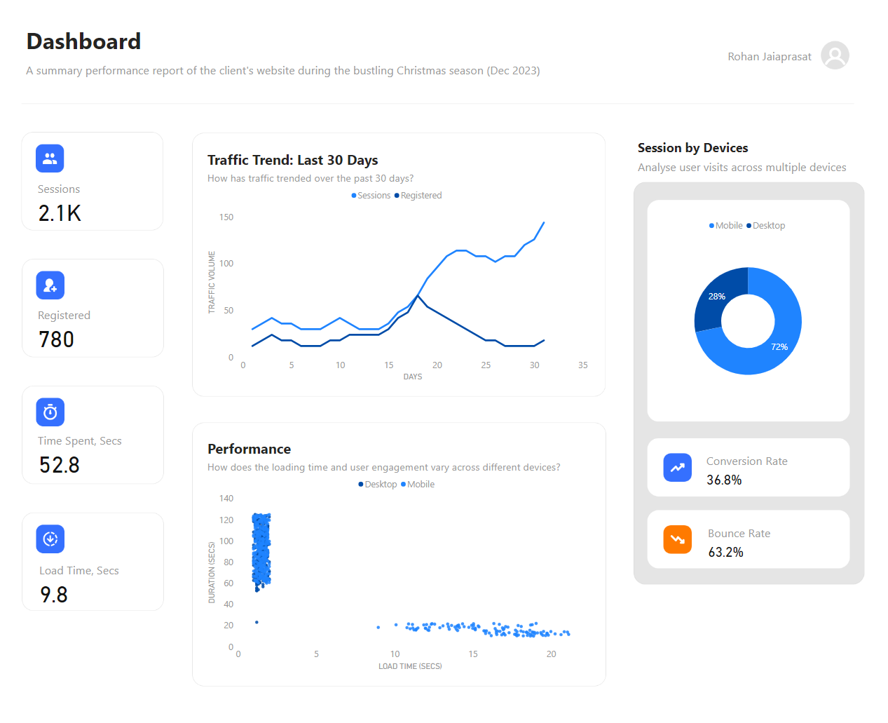

## Optimise E-Commerce Conversion Rates

### Abstract
This project aims to improve e-commerce conversion rates through comprehensive data analysis, leveraging SQL, MySQL, and Power BI to investigate key factors influencing website performance and user behaviour. Despite a rise in sessions, conversion rates were unsatisfactory. The analysis reveals issues with platform responsiveness and load time, especially on mobile devices, which adversely affected user engagement. Recommendations include adopting responsive design and optimising assets to improve load times, thereby enhancing user experience and boosting conversion rates.

### Keywords
SQL, MySQL, MySQL Benchmark, Power BI Desktop, Excel, ETL (Extract, Transform, Load), PowerQuery, DAX, M-Language, Data Collection, Data Wrangling, Data Modelling, Visualisation, Presentation, Storytelling, Critical Thinking, Problem-solving, Analytics, Project Management, Continous Learning, Star Schema, SCQA Framework, Web Analytics, Responsive Design, Conversion Rate Optimisation.

## Problem Statement
In anticipation of the 2023 Christmas season, an entrepreneur launched a website trial. Despite increased sessions, registration conversion rates fell short, resulting in a modest customer base. The entrepreneur is seeking to gain insights into the website's performance and identify actionable strategies for improvement.

## Project Objectives & Scope
**Traffic Analysis** Assess the website's performance throughout December 2023, analysing crucial metrics including sessions, registrations, conversion rates, and bounce rates. 

**Identify trends to understand user behaviour and engagement patterns:** Investigate the reasons behind low conversion rates despite high traffic volumes.

## Deliverables

**Dashboard Report:** An interactive dashboard showcasing real-time analytics and performance metrics, enabling informed decision-making.

<a href="https://drive.google.com/file/d/1076VIPXDFAzil1TQgqynPsfWDgNBzAA9/view?usp=sharing" target="_blank">Access & Download Dashboard</a>

**Storytelling Presentation:** An engaging presentation summarising key insights, discuss strategies to enhance website performance and conversion rates.

<a href="https://drive.google.com/file/d/1od-HZx0lh_RXJrQSAg2MQMxo5HVHzOHi/view?usp=sharing" target="_blank">Access & Download PDF version</a>

## Tools & Technologies
+ **SQL & MySQL:** Conducted data manipulation, transformation, and modelling to extract insights.
+ **Excel:** Constructed visual repesentations, such as charts and graphs to illustrate data trends and patterns.
+ **Figma:** Designed dashboard mockup to visualise the layout, colour scheme, and components before implementation.
+ **PowerBI Desktop:** Created interactive dashboard for presenting key findings.
+ **PowerPoint:** Formulated presentation to impart data insights in an engaging and comprehensible manner (storytelling).

## Explore each chapters in-depth on the data analysis process
+ <a href="./stages/1.prepare/">Data Collection</a>
+ <a href="./stages/2.clean/">Data Wrangling</a>
+ <a href="./stages/3.model/">Data Modelling</a>
+ <a href="./stages/4.analyse/">Analysis I, II & Visuals</a>
+ <a href="./stages/5.visual/">Visualisation (Dashboard)</a>

## Insights & So What?
Several critical insights have emerged regarding the website's performance. Data indicates a peak in session numbers by mid-December, continuing to rise until the end of the month. Despite this heightened activity, registration rates remained disappointingly low. Further investigation revealed a disparity in conversion rates between desktop and mobile users, primarily attributed to slower loading times on mobile devices, ranging between 15-30 seconds. 

Analysis demonstrated a significant correlation between load time and user engagement, with longer load times resulting in increased user abandonment. Experts and developers recommend a loading time of less than 10 seconds for optimal experience.

In light of these findings, prioritising responsive website design and optimising content across platforms is essential. Implementing responsive design techniques to seamlessly adapt to various screen sizes and resolutions is recommended. Additionally, efforts should be made to optimise images, scripts, and other elements to reduce load time and minimise hardware resource usage. Continuous monitoring and regular audits across different devices are imperative. Acquiring user feedback and conducting A/B testing are additional crucial steps for enhancing user experience and maximising conversion.

## Data Limitations

**Page Interaction Data:** Missing data on user interactions with specific pages (e.g., homepage, registration form).

**Detailed User Behavior:** Limited insights into session duration, bounce rate, and conversion. More detailed metrics, such as unique sessions, and returning visitors, offer deeper insights into user engagement and funnel analysis.

**Browser Data:** Lack of information on browsers used, hindering analysis of compatibility issues.

**Traffic Sources:** Unclear origins of traffic and geographic regions. It can help refine marketing strategies (CPC, CTR, CPM, etc.) and allocate resources (server host).

**Demographic Data:** Missing visitor demographic profiles (age, gender, interests).

## Project Limitations
**Scope:** Analysis restricted to December 2023, not capturing long-term trends or seasonal variations in consumer behaviour.

**Causal Analysis:** Correlations observed may not imply causation; further causal analysis required to validate assumptions.

**Feedback Loop:** Limited integration of feedback mechanisms for continuous improvement.

**External Factors:** Analysis focuses on internal metrics, excluding market trends, economic conditions, or competitor actions.

**Visitor Representation:** Data may not represent the entire visitor population, excluding those who did not engage or are underrepresented.