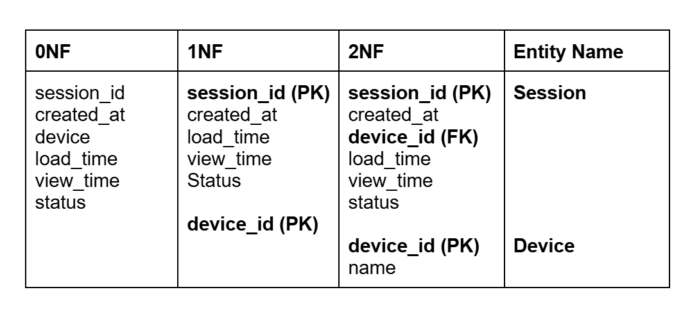
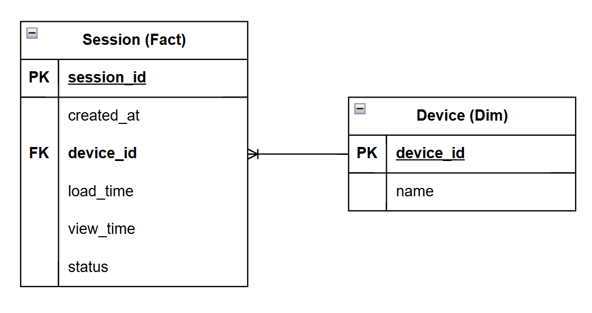

# Data Modelling

This section illustrates the implementation of the **star schema** modelling technique to structure the present data.

### Normalisation
Normalisation is a process employed to organise database to reduce redundancy and improve data integrity.

### ERD (Entity-Relationship Diagram)

Provides an overview of the relationships between different entities.

