# Analysis I: Performance Overview

**Total Session** 
How many sessions were generated during the trial month (December)?

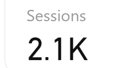

**Total Registrant** 
How many sessions were completed the registration?

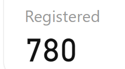

**Device Usage** 
What type of devices did visitors use to access the site?

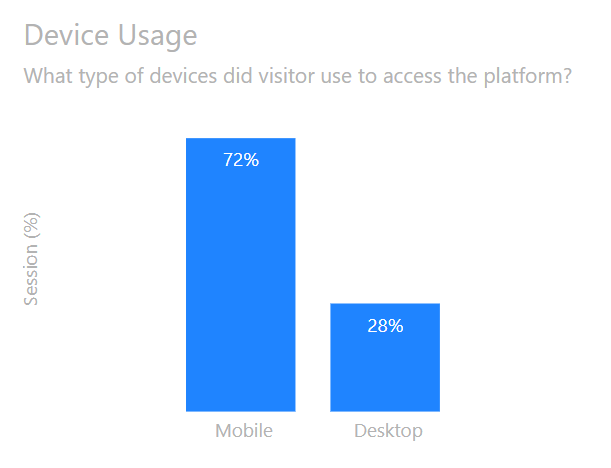

**Load & Duration Per Session** 
What were the average load time and duration per session?

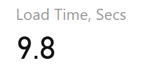
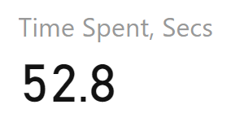

**Conversion & Bounce Rate** 
What was the percentage rate of completed registrations versus bounce rates?

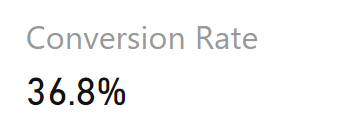
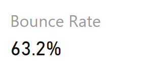

**Monthly Trend: Traffic Vs Registration** 
How did traffic (sessions) correlate with registration numbers throughout December?

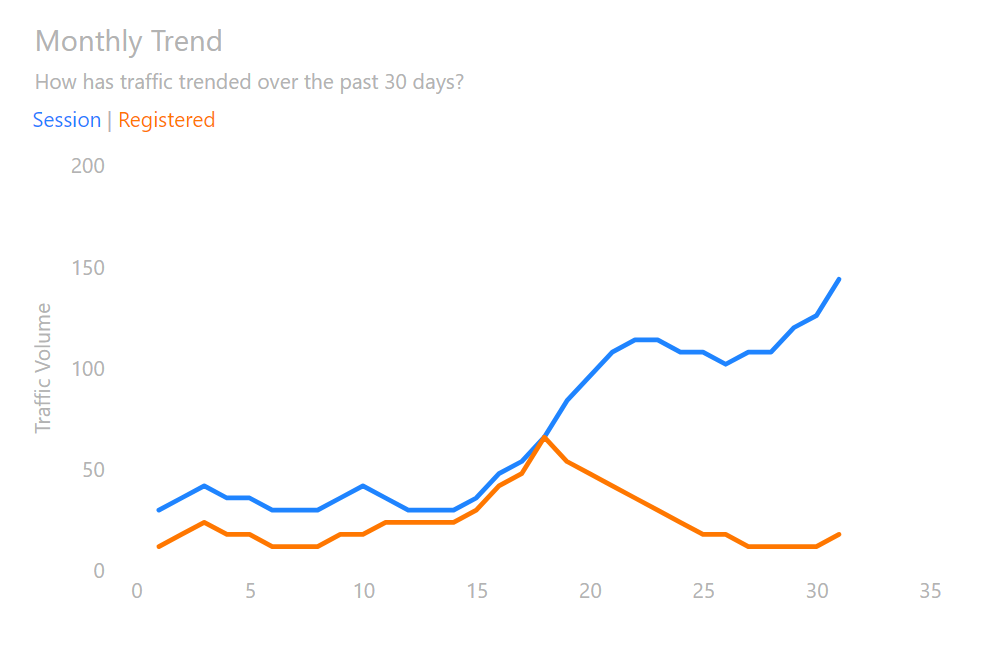

# Analysis II & Visuals: Deeper investigation

**Page Load Time & Duration Differences** 
How did page load time and session duration differ between registrant and non-registrant?

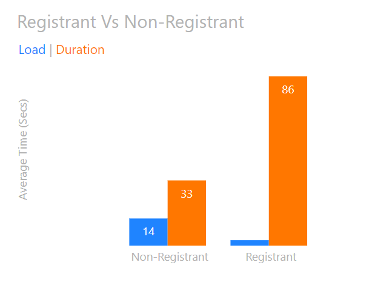

**Device Usage Among Registrants?** 
Are there any preferable device used by registrant?

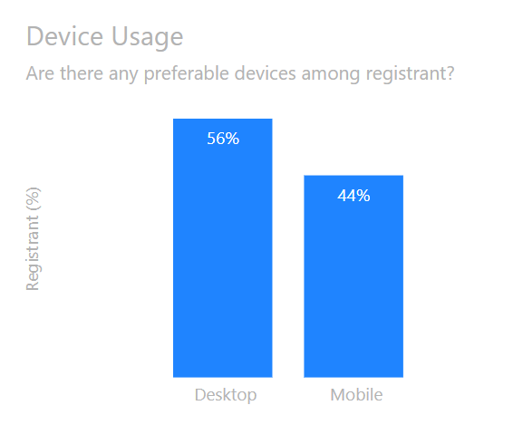

**Fluctuations in Bandwidth and Load Time** 
Were there specific days with bandwidth fluctuations affecting load times across devices?

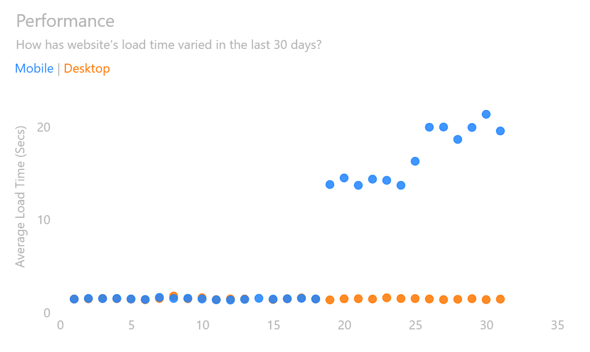
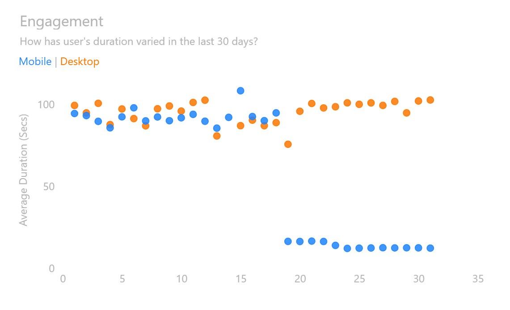